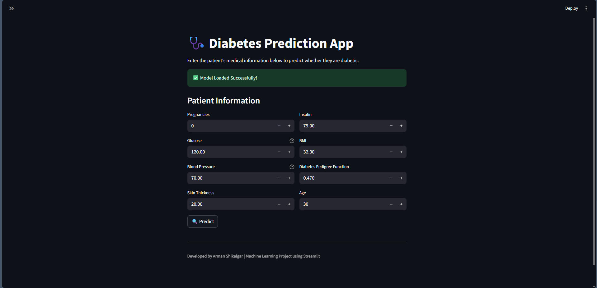
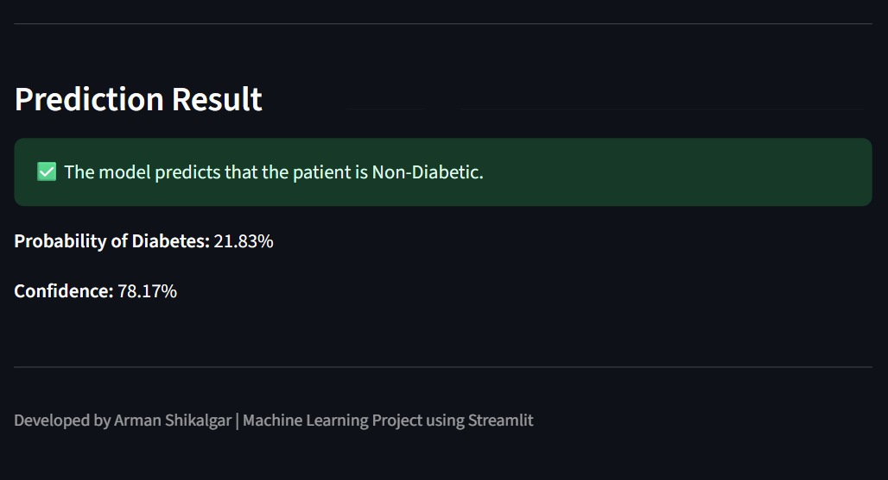

# 🩺 Diabetes Prediction using Logistic Regression

A Machine Learning web application that predicts whether a patient is likely to have diabetes based on medical parameters. The application is built using **Logistic Regression** and deployed with **Streamlit**.

---

## 🚀 Live Demo

🔗 **Streamlit App:** https://diabetes-prediction-logistic-regression-arman.streamlit.app/

---

## 📌 Project Overview

Diabetes is one of the most common chronic diseases worldwide. Early prediction can help individuals seek medical attention sooner.

This project uses the **Pima Indians Diabetes Dataset** to train a **Logistic Regression** model capable of predicting whether a patient is diabetic based on several health-related features.

The trained model is integrated into a **Streamlit** web application, allowing users to enter patient information and receive an instant prediction.

---

## ✨ Features

- Interactive Streamlit Web Application
- User-friendly input interface
- Predicts Diabetes using Logistic Regression
- Displays prediction result instantly
- Shows probability/confidence of prediction
- Responsive and clean UI

---

## 🛠️ Tech Stack

- Python
- Streamlit
- Scikit-learn
- NumPy
- Pandas
- Matplotlib
- Seaborn
- Pickle

---

## 📂 Project Structure

```text
Diabetes-Prediction/
│
├── app.py
├── requirements.txt
├── README.md
├── .gitignore
│
├── model/
│   ├── model.pkl
│   └── scaler.pkl
│
├── data/
│   └── pima-indians-diabetes.csv
│
├── notebook/
│   └── diabetes_prediction.ipynb
│
└── images/
    ├── home.png
    └── output.png
```

---

## 📊 Dataset

**Dataset:** Pima Indians Diabetes Dataset

### Features

- Pregnancies
- Glucose
- Blood Pressure
- Skin Thickness
- Insulin
- BMI
- Diabetes Pedigree Function
- Age

### Target

- 0 → Non-Diabetic
- 1 → Diabetic

---

## 🤖 Machine Learning Workflow

- Data Collection
- Data Exploration
- Exploratory Data Analysis (EDA)
- Data Cleaning
- Feature Scaling using StandardScaler
- Train-Test Split
- Logistic Regression Model Training
- Model Evaluation
- Model Serialization using Pickle
- Streamlit Deployment

---

## 📈 Model Performance

| Metric | Score |
|---------|--------|
| Accuracy | **75.32%** |
| Precision | **66.67%** |
| Recall | **61.82%** |
| F1 Score | **64.15%** |
| ROC-AUC Score | **82.30%** |

---

# 📸 Application Screenshots

## 🏠 Home Page



---

## 🔍 Prediction Output



---

## ⚙️ Installation

Clone the repository

```bash
git clone https://github.com/Arman1263/Diabetes-Prediction-Logistic-Regression.git
```

Navigate to the project

```bash
cd Diabetes-Prediction-Logistic-Regression
```

Install dependencies

```bash
pip install -r requirements.txt
```

Run the application

```bash
streamlit run app.py
```

---

## 📌 Future Improvements

- Improve prediction accuracy using advanced models
- Hyperparameter tuning
- Feature Engineering
- Deploy using Docker
- Add SHAP Explainability
- User Authentication
- Store prediction history

---

## 👨‍💻 Author

**Arman Shikalgar**

- GitHub: https://github.com/Arman1263
- LinkedIn: *Add your LinkedIn profile here*

---

## ⭐ Support

If you found this project helpful, consider giving it a ⭐ on GitHub.


